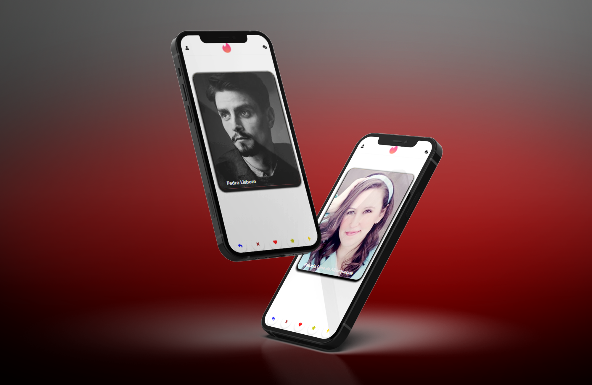

<div align="center">
  <p align="center">
    
  </p>
 <h1>Tinder Clone</h1>
 <h3>Projeto em Reactjs responsivo para mobile.<h3>
</div>

## Pacotes

```bash
npm install --save @fortawesome/free-solid-svg-icons
```

```bash
npm install --save @fortawesome/react-fontawesome
```

```bash
npm install react-tinder-card
```

```bash
npm install axios
```
